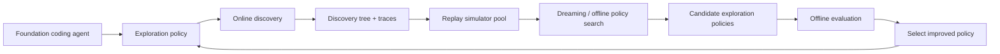
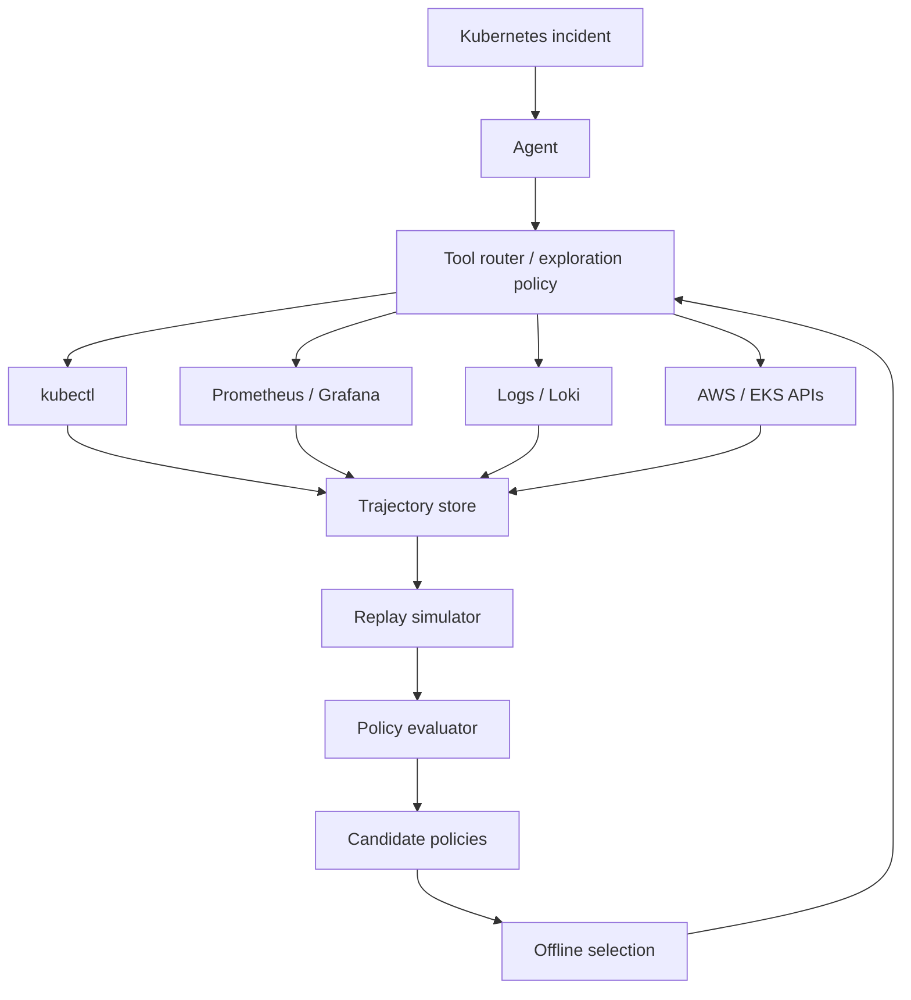

# Dream-RSI: Recursive Self-Improvement through Evolving Worlds

## Executive summary

Dream-RSI is a 2026 research framework from authors affiliated with Google, Google DeepMind, the University of Maryland, and the University of Virginia. It targets **recursive self-improvement at the exploration-policy layer**, rather than changing the underlying foundation model weights.

The central idea is simple but powerful:

> A discovery history can become a replay simulator.

An agent performs expensive online exploration and records a tree of attempts, observations, branches, and outcomes. Dream-RSI then uses those recorded histories to test alternative exploration policies offline. Candidate policies can be scored by replaying the historical tree instead of repeatedly invoking the expensive coding agent and evaluator. The best policy is redeployed online, producing new discovery histories that expand the simulator pool. This creates the recursive loop:

**Explore → Record → Replay/Dream → Improve exploration policy → Deploy → Explore again**

The paper reports experiments in algorithm engineering, mathematical optimization, and GPU-kernel engineering. The authors report improvements or competitive results while reducing discovery cost in several settings. The released project page says the underlying coding agent remains unchanged and that the RSI loop occurs at the meta-exploration layer.

## What RSI means here

Recursive self-improvement (RSI) broadly describes systems that use the results of one improvement cycle to improve the mechanism used in subsequent cycles.

Dream-RSI is narrower than the popular idea of an AI rewriting its own model:

- It does **not** retrain the foundation model weights in the reported method.
- It does **not** claim autonomous general intelligence.
- It improves the **exploration policy** that decides where to search, what to run in parallel, and when to stop.
- The coding agent, evaluator, and execution interface remain fixed in the reported setup.
- The current deployed policy is included as a candidate, which gives the offline selection procedure a built-in incumbent baseline.

## Core architecture



The important separation is:

**Model layer:** the underlying model stays fixed.

**Meta-policy layer:** the software controlling exploration changes.

**Environment/evaluator layer:** the system uses recorded outcomes to cheaply test alternative decisions before spending another real execution budget.

## Why "dreaming" works

A conventional simulator normally has to be built or learned. Dream-RSI instead treats the already-executed discovery tree as a simulator of the portion of the search space that has actually been visited.

If a previous run already recorded:

- branch A → result X
- branch B → result Y
- branch C → result Z

then a new exploration policy can choose a different order or branching strategy over those recorded outcomes without rerunning the underlying expensive computation.

This is especially valuable for long-horizon discovery where feedback arrives late and each online rollout is expensive.

## The recursive loop

At iteration t:

1. Deploy policy π_t.
2. Run online discovery.
3. Record the resulting discovery tree.
4. Add the tree to the accumulated history.
5. Generate candidate revisions of the exploration policy.
6. Replay those policies against the historical simulator pool.
7. Select the best-scoring candidate.
8. Deploy π_(t+1).
9. Repeat.

The important recursion is therefore not "the model rewrites itself." It is:

**the system improves the strategy that determines how the model searches.**

## Reported results

The project page reports results across three areas:

### Algorithm engineering

The authors report fewer discovery generations for comparable performance on some tasks and substantially fewer discovery-agent calls versus a SimpleTES comparison on Lasso.

### Mathematical optimization

The project reports competitive or improved scores on the tested optimization tasks relative to the selected baselines.

### GPU kernel engineering

The project reports comparable performance with fewer generations on some KernelBench tasks and higher performance at comparable budget on others.

The exact numbers should be treated as **paper/project-page experimental results**, not as proof that RSI is solved generally. The experiments are bounded to the evaluated domains and infrastructure.

## Dream-RSI vs AlphaEvolve

Google DeepMind's AlphaEvolve is an important predecessor/context point. AlphaEvolve combines Gemini models with automated evaluators and an evolutionary framework to generate and select increasingly effective algorithms.

Dream-RSI moves the recursive improvement question one layer upward:

- **AlphaEvolve:** evolve candidate algorithms/programs.
- **Dream-RSI:** evolve the exploration policy that decides how an agent searches through candidate solutions.

This makes Dream-RSI particularly relevant to agent orchestration and AgentOps.

## Relevance to MLOps

Dream-RSI is useful for thinking about MLOps beyond model training.

A future MLOps platform can treat experiments as a continuously improving search process:

**Git commit → build → test → benchmark → telemetry → experiment history → policy optimization → next experiment**

Examples:

- Automatically learn which hyperparameter regions to explore next.
- Learn when to stop low-value experiments.
- Adjust experiment parallelism based on historical outcomes.
- Select which model variants deserve expensive GPU evaluation.
- Replay previous experiments before launching new ones.
- Optimize evaluation budgets rather than only model accuracy.

This connects directly to experiment tracking, model evaluation, feature stores, artifact stores, orchestration, and observability.

## Relevance to AgentOps

This is even more directly relevant to AgentOps.

An AgentOps platform needs to observe and optimize not only the agent's final answer but also its behavior:

- Which tool did it call?
- In what order?
- How many times?
- What branch did it choose?
- When did it stop?
- Which attempts failed?
- Which trajectories produced useful results?
- How much latency and cost did each trajectory consume?
- Which policy produced the best outcome?

Dream-RSI suggests turning these traces into a **replayable learning environment**.

That means an AgentOps platform could evolve from:

**Observe → Alert**

toward:

**Observe → Record → Replay → Evaluate → Improve policy → Deploy → Observe again**

## How you can apply the idea to your DevOps + AgentOps path

Your existing AI Observability Platform is a strong starting point.

Instead of building only a troubleshooting agent, evolve it into a policy-learning troubleshooting platform.

Example:

A Kubernetes incident occurs.

The agent can choose among:

1. Check pod status.
2. Read events.
3. Inspect logs.
4. Describe deployment.
5. Check service endpoints.
6. Check ingress/ALB.
7. Check resource pressure.
8. Inspect dependencies.
9. Query Prometheus/Grafana.
10. Propose remediation.

Every investigation becomes a trajectory.

Store:

- incident ID
- cluster/context
- initial symptoms
- tool calls
- order of tool calls
- observations
- hypotheses
- actions
- final root cause
- remediation
- success/failure
- latency
- token cost
- infrastructure cost
- confidence
- human approval/rejection

After enough incidents, build a replay dataset.

Then test alternative troubleshooting policies offline.

Example:

**Policy A:** logs → describe → events → service

**Policy B:** events → describe → endpoints → logs

**Policy C:** metrics → events → logs → dependencies

Score each trajectory using a deterministic evaluator such as:

```
Score =
  RootCauseAccuracy
  + TimeToDiagnosis
  + RemediationSuccess
  - ToolCost
  - UnnecessaryCalls
```

The winning policy becomes the next production policy.

That is a practical AgentOps interpretation of the Dream-RSI idea.

## Concrete project for you

### Project: DreamOps — Self-Improving Kubernetes Troubleshooting Agent

Architecture:



### Phase 1 — Observability

Capture every troubleshooting trajectory.

### Phase 2 — Replay

Build a local replay engine where previously observed tool results can be replayed.

### Phase 3 — Policy candidates

Create multiple strategies for selecting the next diagnostic action.

### Phase 4 — Evaluation

Measure root-cause accuracy, number of tool calls, time-to-diagnosis, remediation success and cost.

### Phase 5 — Recursive improvement

Automatically generate and evaluate policy revisions against the replay corpus.

### Phase 6 — Guarded deployment

Deploy the selected policy to a staging environment first, then production with human approval and rollback.

## Suggested technology stack

**Agent:** Python + FastAPI

**Model:** Qwen/Ollama locally for experiments; optionally a stronger hosted model for comparison

**Agent framework:** lightweight custom orchestrator first; add LangGraph or another framework only when state/graph complexity requires it

**Kubernetes:** Kind/Minikube initially, then EKS

**Observability:** Prometheus + Grafana + Loki + Jaeger

**Trajectory store:** PostgreSQL

**Experiment tracking:** MLflow or a lightweight PostgreSQL experiment schema

**Artifacts:** S3-compatible storage

**Policy versions:** Git

**Deployment:** Docker → Kubernetes → Helm → Argo CD

**Infrastructure:** Terraform

**Evaluation:** deterministic test harness + incident replay corpus

## What you should learn from this

For your MLOps → AgentOps progression, the key concept is not "train an AI to rewrite itself."

Learn these layers:

1. **ModelOps** — model lifecycle, registry, evaluation, deployment.
2. **MLOps** — experiments, data, features, pipelines, monitoring.
3. **LLMOps** — prompts, model routing, evaluations, cost, latency, tracing.
4. **AgentOps** — tool use, trajectories, state, policies, guardrails, replay.
5. **Policy optimization** — improve how agents search and act.
6. **Evaluation infrastructure** — objective feedback loops.
7. **Replay systems** — learn from historical executions before spending live compute.
8. **Safe deployment** — canary, approval gates, rollback and policy versioning.

## Day-to-day uses

The Dream-RSI principle can be applied without building a self-improving superintelligence.

For personal productivity:

- Record how you solve recurring technical problems.
- Build a library of successful and failed troubleshooting paths.
- Replay alternative workflows.
- Measure time/cost/error rate.
- Adopt the workflow that performs best.
- Repeat as your knowledge base grows.

For DevOps:

- Optimize incident diagnosis paths.
- Optimize CI/CD troubleshooting.
- Optimize deployment validation.
- Learn which observability signals should be checked first.
- Reduce unnecessary tool calls.

For MLOps:

- Optimize experiment selection.
- Optimize model evaluation budgets.
- Prioritize promising hyperparameter regions.
- Reduce redundant training runs.

For AgentOps:

- Optimize tool-selection policies.
- Reduce unnecessary agent loops.
- Learn stopping conditions.
- Compare agent trajectories.
- Improve routing and escalation policies.

## Important limitations

Dream-RSI does not demonstrate unrestricted self-improvement.

The reported method is bounded by:

- the search space represented in the historical discovery trees;
- the quality of the evaluator;
- the quality and coverage of recorded trajectories;
- the fixed underlying agent/model;
- the tasks used for evaluation;
- the cost of collecting new online history.

A replay simulator cannot magically tell the system what would happen in parts of the world that were never recorded. This is one of the most important engineering lessons.

## Key takeaway

The most useful mental model for your career is:

**Don't think "AI that improves its own brain."**

Think:

**"An agent that learns how to spend its reasoning, tool, compute and search budget better by replaying what it has already experienced."**

That is highly relevant to the transition you want to make from DevOps → MLOps → AgentOps.

## Research status

Status: Emerging

This is a very recent 2026 research direction. The project page states that the full codebase and reproduction scripts are still being prepared for release, so hands-on reproduction should be treated as a follow-up experiment rather than an already-established open-source workflow.

## Primary sources

- Dream-RSI project: https://www.dream-rsi.com/
- Paper: https://arxiv.org/abs/2609.14858
- GitHub: https://github.com/zhengkid/Dream-RSI
- Google DeepMind AlphaEvolve: https://deepmind.google/blog/alphaevolve-a-gemini-powered-coding-agent-for-designing-advanced-algorithms/
- Google DeepMind AlphaEvolve impact update: https://deepmind.google/blog/alphaevolve-impact/

## Next experiments for Tech Intelligence HUB

1. Reproduce the core replay idea with a tiny deterministic search problem.
2. Build a Kubernetes troubleshooting trajectory recorder.
3. Build a replay simulator for recorded tool calls.
4. Implement three competing troubleshooting policies.
5. Create a deterministic evaluator.
6. Run offline policy selection.
7. Deploy the selected policy in a Kind cluster.
8. Compare live performance against the original fixed policy.
9. Document the results in LearnLog.
10. Turn the experiment into an AgentOps architecture post.
